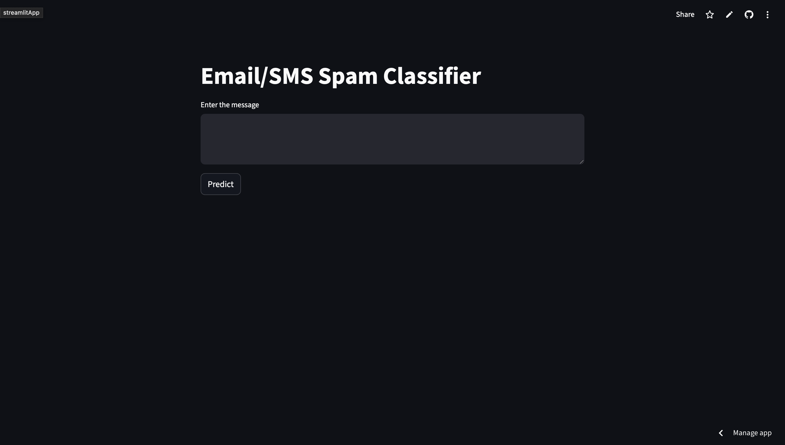
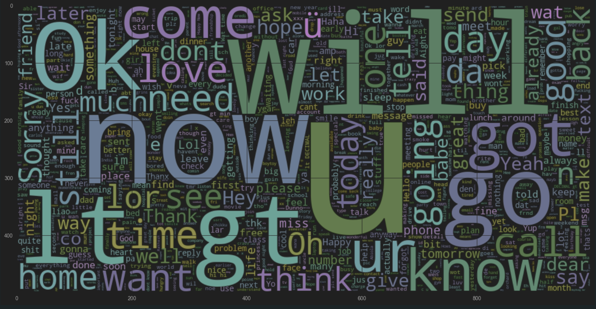
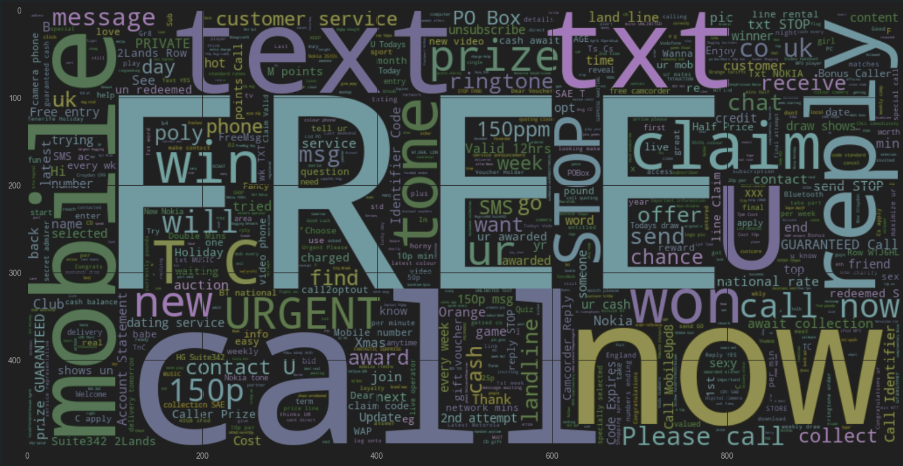
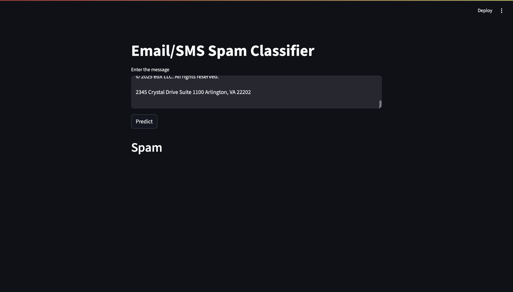

# Spam Detection Project

A machine learning project that uses Naive Bayes classification to detect spam messages. The project includes a trained model, web interface, and comprehensive testing.

## Project Structure

- `Spam_detection.ipynb` - Jupyter notebook containing the model development and analysis
- `spam_detector.py` - Python script for the spam detection implementation
- `model.pkl` - Trained Naive Bayes model
- `vectorizer.pkl` - Text vectorizer for feature extraction
- `spam.txt` - Dataset containing spam and ham messages
- `requirements.txt` - Python dependencies

## Features

- Naive Bayes classification for spam detection
- Text preprocessing and vectorization
- Web interface for real-time predictions
- Model evaluation with confusion matrix

## Model Performance

The Naive Bayes classifier shows excellent performance in distinguishing between spam and legitimate messages:


## Web Interface

The project includes a user-friendly web interface for testing the spam detector:

### Deployed Application


### Testing Examples

**Ham (Legitimate) Message Word Cloud:**


**Spam Message Word Cloud:**


**Testing Interface:**


## Installation

1. Clone the repository
2. Install dependencies:
```bash
pip install -r requirements.txt
```

## Usage

1. Run the spam detector:
```bash
python spam_detector.py
```

2. Open the web interface in your browser
3. Enter a message to test whether it's spam or ham

## Model Training

The model was trained using the dataset in `spam.txt` and uses:
- Text preprocessing and cleaning
- TF-IDF vectorization
- Naive Bayes classification
- Cross-validation for model evaluation

For detailed analysis and training process, see the [Spam_detection.ipynb](Spam_detection.ipynb) notebook.

## Files Description

- **[model.pkl](model.pkl)** - Serialized trained Naive Bayes model
- **[vectorizer.pkl](vectorizer.pkl)** - Serialized TF-IDF vectorizer
- **[spam_detector.py](spam_detector.py)** - Main application script
- **[spam.txt](spam.txt)** - Training dataset
- **[Spam_detection.ipynb](Spam_detection.ipynb)** - Development notebook
- **[requirements.txt](requirements.txt)** - Project dependencies